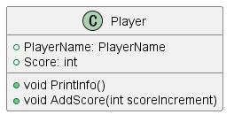
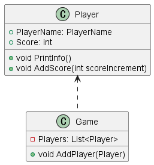
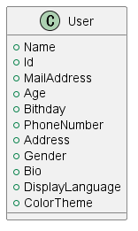
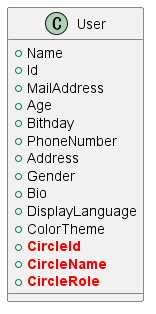
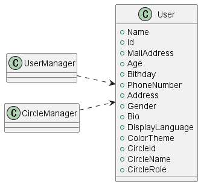
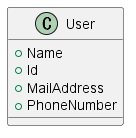

<header>

# 手続き型言語プログラマに分からせるオブジェクト指向入門
<div class="author">rinrin24</div>

</header>

<main>

## はじめに
2023年度高校マイコン部の部長です。ここ2年程度オブジェクト指向に触れてきてその素晴らしさに感銘を受けたのでそれを共有したいと思います。

それとこの部活では手続き型言語(特にHSP)ばかり使っている人間が多く、またそれこそが至高だと思っている人や、オブジェクト指向よくわからないといった人が多いので彼ら向けに**分からせる**つもりで書きます。

一応変数や関数などの基本的なプログラミングの知識があれば理解できるような文章を目指します。また、ここではC#を使って説明します。ただしわかりやすくするためにusing宣言やnamespaceなどを省略します。

## 目次
0. モノ中心のプログラミング
   1. OOPは現実のものをそのまま表せる？
1. 手続き型言語から進化したオブジェクト指向
   1. OOPがもつ三大要素
      1. クラス
      2. ポリモーフィズム
      3. 継承
2. クラスとは
   1. 変数、関数をまとめ、何個も作ることができる
   2. 情報隠蔽という強力な機能(プライベートフィールド)
   3. クラスを「型」として扱う(型チェックについて)
3. プログラミングを補助するOOPの強力な機構
   1. パッケージ
   2. 例外
   3. ガベージコレクション
   4. OOPが構造化言語から失った機能？
4. モデリング
5. 開発手法
   1. アジャイル・スクラム・XP
   2. リファクタリング
   3. TDD
   4. DDD
6. 関数型言語について

## 0. モノ中心のプログラミング
さて、早速オブジェクト指向とは何かというところから入っていきましょう。Object Oriented Programming(以降OOP)、直訳するとモノ指向型、モノ中心のプログラミングといった意味になります。

オブジェクト指向が普及する前はいわゆる構造化プログラミングというものが主流でした。どういうものかというと、昨今ではよく目にするフローチャートでできたようなものです。情報学的に言うと順次、選択、反復の3つの要素ですね。処理を順番に実行していき、場合によっては別の処理を実行したり、その処理を繰り返したりといったことです。

つまり構造化プログラミング言語ではこういった「処理」、つまるところソフトウェアの「機能」が中心とされてきました。しかしこの機能中心のプログラミングには問題があります。これらはプログラムの可読性の低下やコードがまとまってないことによって、メンテナンスがしにくくしたり、また機能の追加も大変になります。長期的な、もしくは大規模なソフトウェアを開発するのには好ましくないでしょう。

これらを克服したのがオブジェクト指向という技術です。OOPはオブジェクトというものにデータと処理をまとめ、一つの部品として独立するようにしたものなのです。オブジェクトはデータと振る舞いを持った一つの独立した「モノ」として扱えるのです。

このデータと振る舞いを持ったものといっても抽象的でわかりにくいですね。具体的に、車を思い浮かべてみましょう。車には複数のデータがあります。現在の速度、ギア、燃料などですね。また、振る舞いももちろん持っています。加速する、カーブする、ウィンカーを出すetc...このようにデータち振る舞いを持った現実世界のモノと同じように扱います。これが**オブジェクト**なのです。

### OOPは現実のものをそのまま表せる？
先ほど現実世界のモノと同じように扱うといいました。ただしそのまま表現するのは無理があります。これはOOPに限らず一般的なプログラミングに共通することです。

OOPではクラスというひな型を定義してからそのひな型に沿ってオブジェクトを生成します(このオブジェクトをインスタンスといいます)。現実に置き換えると人間というひな型から佐藤や高橋が生まれるみたいなものでしょうか。このクラスというものは一種の分類方法ともみなせますね。しかし、高橋は人間であると同時に、動物ですね。まだ人間is動物の関係ならば継承という機能を使えば大丈夫なのですが、他にも様々な分類方法があります。高橋は日本人です、高橋は成人です、高橋は大学生です。出身、年齢区分、身分など、分類方法を挙げていったらキリがありません。

これを全てそのままクラスとして反映させることは不可能です。私たちはそれらの重要な部分だけを取り出すモデル化という行為でプログラムに落とし込むのです。

つまるところ、OOPにおけるオブジェクトというのは現実世界をそのまま反映したものではなく、あくまでもプログラミングで使う便利なツールだということを念頭においてください。現実のものを使った比喩のややこしい説明を今まで何度か見てきたのでとにかくObjectにはモノという意味はあっても現実世界のものそのものではないということを伝えたかったです。

## 1. 手続き型言語から進化したオブジェクト指向
今までの言語を手続き型言語と一括りにしてしまうのは少々乱暴なきもしますが、ここではとりあえずgoto文辺りの構造化言語の辺りから話し始めます。

その前にざっとOOPの強力な機能について話します。

### OOPがもつ三大要素
1. カプセル化
    まずカプセル化とは、データと手続きをまとめる機能です。そのために、クラスというものを使います。ここではクラスの機能について軽く紹介します。

    **クラス**とは、データと手続きをあわせもったもののことです。
    軽くプログラムを書いてみましょうか。
    ```C#
    class Car{
        public Car(int newFuel){		// コンストラクタ
            this.Fuel = newFuel;
            this.Speed = 0;
        }

        public void Accelerate(void){	// 車が加速するメソッド
            this.Fuel -= 10;
            this.Speed += 10;
        }
        public int Fuel { get; set; }			// 燃料を表すインスタンス変数
        public int Speed { get; set; }			// スピードを表すインスタンス変数
    }
    ```
    ざっと車クラスを定義してみました。

    このクラスは二つの関数と二つの特別な変数を持っています。

    このクラスの中にあるAccelerateなどの関数のことを**メソッド**、特にクラスの名前と同じメソッドのことを**コンストラクタ**といいます。そしてFuelなどの変数を**インスタンス変数**といいます。

    クラスというのは、ひな型ということを何回か話しましたね。クラスはそのままだと抽象的なものなの、いわばお菓子作りにおけるカップのようなもので、プリンを作るにはその中にプリンを入れる必要がありますね(蒸すといった工程は無視してください……)。そのひな型(クラス)からできたお菓子のことを**インスタンス**と呼びます。

    ```C#
    Car myCar = new Car(100);               // Carクラスのインスタンスを生成
    ```

    この`myCar`という変数に車クラスのインスタンスが代入されました。インスタンスが作成されるとき、特別なメソッドであるコンストラクタが呼び出されます。先ほど定義した`Car(int newFuel){~`の部分ですね。ここでは引数に100という数字が与えられているので、`newFuel`には100が代入され、さらに`Fuel`というインスタンス変数に100が代入されます。C#ではインスタンス変数に同じクラスのメソッドから代入するときは`this.変数名`のように書きます。

    インスタンス変数というのはそのインスタンス特有の変数です。

    ```C#
    myCar = new Car(100);
    Console.WriteLine(myCar.Fuel);      // myCar.Fuelを表示
    Console.WriteLine(myCar.Speed);     // myCar.Speedを表示
    myCar.Fuel = 200;                   // myCar.Fuelに200を代入
    myCar.Speed = 50;                   // myCar.Speedに50を代入
    Console.WriteLine(myCar.Fuel);      // myCar.Fuelを表示
    Console.WriteLine(myCar.Speed);     // myCar.Speedを表示
    ```

    > 出力結果
    ```
    100
    0
    200
    50
    ```
    このように`myCar.Fuel`のようにすることでインスタンス変数にアクセスすることができます。インスタンス変数はインスタンス特有のものなので他のインスタンスを作ったら別のものとして扱われます。

    ```C#
    Car car1 = new Car(100);
    Car car2 = new Car(200);
    Console.WriteLine(car1.Fuel);
    Console.WriteLine(car2.Fuel);
    ```

    > 出力結果
    ```
    100
    200
    ```
    `car1`のインスタンスではコンストラクタでインスタンス変数`Fuel`に100が代入されていますが、`car2`のインスタンスの`Fuel`では200が代入されています。このようにインスタンスを作るとそのなかのインスタンス変数はインスタンスごとに独立したものになります。

    少しややこしくなってきましたね。一度まとめます。

    まずクラスというものには関数と変数があります。それぞれを**メソッド**、**インスタンス変数**と呼びます。またクラスと同じ名前を持つメソッドを特別に**コンストラクタ**と呼びます。クラスはひな型なのでそのままでは使うことができず、実物を作る必要があります。そうしてできたものが**インスタンス**といいます。インスタンスを作成するときにはコンストラクタが呼び出されます。また、インスタンス変数はインスタンスごとに特有のものになっています。

    分かる人は関数を含んだ構造体みたいなイメージを持ってください。

    以上が簡単なクラスの説明になります。

2. ポリモーフィズム

    OOPが持つ強力な機能の2つ目がポリモーフィズムです。ポリモーフィズム(polymorphism)は「いろいろな形に変わる」といった意味を持ちます。

    ポリモーフィズムは簡単に言ってしまうと複数のクラスで共通のメソッドを作るということです。

    この字面だけでは何を言っているのか全く分かりませんね。例を交えて説明しましょう。例えば長方形を表すクラス、`Rectangle`があるとします。ここでは`GetArea`という面積を計算するメソッドがあるとします。また、三角形を表すクラス`Triangle`というクラスがあるとします。こちらでも`GetArea`メソッドを実装します。ここではどちらも同じメソッドがあり、どちらも同じ働きをしますね。しかしもちろん具体的な処理内容は異なります。`Rectangle`クラスでは幅と高さの積を求めますが、`Triangle`クラスでは幅と高さの積の半分を求めます。

    ```C#
    class Rectangle{
        public Rectangle(int newWidth, int newHeight){
            this.Width = newWidth;
            this.Height = newHeight;
        }
        public int GetArea(){
            return this.Width * this.Height;
        }
        public int Width { get; set; }
        public int Height { get; set; }
    }

    class Triangle{
        public Triangle(int newWidth, int newHeight){
            this.Width = newWidth;
            this.Height = newHeight;
        }
        public int GetArea(){
            return this.Width * this.Height / 2;
        }
        public int Width { get; set; }
        public int Height { get; set; }
    }
    ```

    ここで、ベースとなるクラス、`Shape`という形を表すクラスを作りましょう。

    ```C#
    abstract class Shape{
        public abstract int GetArea();
    }
    ```

    `abstract`や`throw~`については今は無視してください。そしてこのクラスに対してこのあとで説明する「継承」という機能を使います。

    ```C#
    class Rectangle : Shape{
        public Rectangle(int newWidth, int newHeight){
            this.Width = newWidth;
            this.Height = newHeight;
        }
        public override int GetArea(){
            return this.Width * this.Height;
        }
        public int Width { get; set; }
        public int Height { get; set; }
    }

    class Triangle : Shape{
        public Triangle(int newWidth, int newHeight){
            this.Width = newWidth;
            this.Height = newHeight;
        }
        public override int GetArea(){
            return this.Width * this.Height / 2;
        }
        public int Width { get; set; }
        public int Height { get; set; }
    }

    abstract class Shape{
        public abstract int GetArea();
    }
    ```

    ここでは、どちらも`Shape`というクラスを継承しています。継承を簡単に説明すると、継承する側is継承される側の関係にします。つまりここではRectangle is Shape、Triangle is Shapeということになります。

    つまり`Rectangle`クラスと`Triangle`クラスは両方とも`Shape`クラスとしても扱えます。

    何を言っているかわからないと思うのでコードで実際に説明します。

    通常は、
    ```C#
    Rectangle shape1 = new Rectangle(10, 20);   // Rectangleクラスのインスタンスを作成
    int shape1Area = shape1.GetArea();          // 面積を計算
    Console.WriteLine(shape1Area);              // 面積を表示

    Triangle shape2 = new Triangle(10, 20);     // Triangleクラスのインスタンスを作成
    int shape2Area = shape2.GetArea();          // 面積を計算
    Console.WriteLine(shape2Area);              // 面積を表示
    ```

    のようにして、Rectangle型の変数、Triangle型の変数に代入します。しかし、Shape型を継承したことによって、
    ```C#
    Shape shape1 = new Rectangle(10, 20);       // Rectangleクラスのインスタンスを作成し、Shape型の変数に代入
    int shape1Area = shape1.GetArea();          // 面積を計算
    Console.WriteLine(shape1Area);              // 面積を表示

    Shape shape2 = new Triangle(10, 20);        // Triangleクラスのインスタンスを作成し、Shape型の変数に代入
    int shape2Area = shape2.GetArea();          // 面積を計算
    Console.WriteLine(shape2Area);              // 面積を表示
    ```

    > 出力結果
    ```
    200
    100
    ```

    のように書くことができます。`Shape`クラスは`GetArea()`というメソッドを持っていますが、`Rectangle`クラス、`Triangle`クラスが`GetArea()`メソッドを上書き(オーバーライド)したことによって`GetArea()`が実行する内容が異なるものになります。これによって関数の引数や戻り値として`Shape`を渡したり、もしくはインスタンス変数の型を`Shape`にすることもできるのです。このように同じ名前のメソッドの名前を共有して同じものとして扱わせるのがポリモーフィズムなのです。

3. 継承

    最後に継承という機能についてです。正直あまり使う機会がなかったので自分自身その利点を説明できるかは分からないのですが、とりあえずどういうものなのかを説明します。

    継承は、複数のクラスがあったとき、その中で共通する変数やメソッドを一つのクラスにまとめて重複を減らすということです。

    継承をするには、共通に使いたいメソッドとインスタンス変数を持ったクラスを新たに定義し、それを利用したいクラスはそれを継承するということを宣言します。OOPではこの共通に使うクラスを**親クラス**やスーパークラスと言い、それを利用するクラスを**子クラス**やサブクラスと呼ばれます。
    
    具体的にコードで見ていきましょう。まず以下の様に猫クラスと犬クラスを定義します。
    ```C#
    class Cat{
        public void SetName(string newName){
            this.Name = newName;
        }
        public void Meow(){
            Console.WriteLine(this.Name+"「ニャー」");
        }
        public string Name { get; set; }
    }
    class Dog{
        public void SetName(string newName){
            this.Name = newName;
        }
        public void Woof(){
            Console.WriteLine(this.Name+"「ワン」");
        }
        public string Name { get; set; }
    }
    ```

    実際にインスタンスとして作成してメソッドを実行すると以下のようになります。

    ```C#
    Cat cat = new Cat();
	cat.SetName("たま");
	cat.Meow();
	Dog dog = new Dog();
	dog.SetName("ぽち");
	dog.Woof();
    ```

    > 出力結果

    ```
    たま「ニャー」
    ぽち「ワン」
    ```

    しかしここでは2つのクラスの中に全く同じ動作をするメソッドがありますね。`SetName()`というメソッドはどちらもインスタンス変数`Name`に文字列を代入するメソッドですね。ではこれを一つのクラスに分離してみましょう。

    ```C#
    class Animal{
		public void SetName(string newName){
			this.Name = newName;
		}
		public string Name { get; set; }
	}
    ```

    C#では`class 子クラス名: 親クラス`のようにして親クラスから継承した子クラスを定義することができます。

    ```C#
    class Cat: Animal{
        public void Meow(){
            Console.WriteLine(this.Name+"「ニャー」");
        }
    }
    class Dog: Animal{
        public void Woof(){
            Console.WriteLine(this.Name+"「ワン」");
        }
    }
    ```

    先ほどはあった`SetName`メソッドと変数`Name`の定義がなくなっていますね。そのかわり両方とも親クラス`Animal`を継承しています。実際に動かしてみると以下のようになり、正常に動いていることがわかりますね。

    ```C#
    Cat cat = new Cat();
    cat.SetName("みけ");
    cat.Meow();
    Dog dog = new Dog();
    dog.SetName("しば");
    dog.Woof();
    ```

    >出力結果

    ```
    みけ「ニャー」
    しば「ワン」
    ```

    このように、全く同じ機能を複数のクラスに実装するときに使われるのが継承です。継承は子クラスis a親クラスの関係を作り出します(親クラスis子クラスとは限らないので注意！)。しかし子クラスは全て同じメソッドを使う必要が出てきてしまうので親クラスでそのメソッドを変更すると全ての子クラスに影響が出てしまうため親クラスを変更するときは慎重になる必要があります。これは委譲(has a の関係を作る)やインターフェースを使うと変更しやすさを残したまま似た構造を作ることができます。

## 2. クラスとは
さて、先ほどカプセル化の項目(1-1-1)でクラスについて概要を説明しましたね。クラスについてどういうものかはなんとなく理解できたと思うので、クラスについてより詳しく説明し、それがオブジェクト指向を使いやすいものにたらしめる理由を説明します。

1. 変数、関数をまとめ、何個も作ることができる
    まずはこのまとめる機能についてです。手続き型言語ではグローバル変数と関数(もしくはサブルーチン)を使ってプログラミングを行っていました。
    
    ではここではゲームのプレイヤーについて扱ってみましょう。以下のコードを見てみて下さい。

    ```C#
    // プレイヤーの名前を表すグローバル変数
    string currentPlayerName = "Alice";

    // プレイヤーのスコアを表すグローバル変数
    int currentPlayerScore = 100;

    // プレイヤーの情報を表示する関数
    void printPlayerInfo(){/*処理の内容は省略*/}

    // プレイヤーのスコアを増やす関数
    void addScore(int scoreIncrement){/*処理の内容は省略*/}
    ```

    ここでは`currentPlayerName`、`currentPlayerScore`という2つのグローバル変数を使っており、加えて2つの関数があります。その中で2つのグローバル変数に対して参照・代入が行われています。

    しかしここには問題があり、まずこれはそれぞれ一つのプレイヤーに関して処理を行っているのに全てがバラバラであるところ、また`addScore`関数がありますが、それを使わずとも変数`currentPayerScore`を簡単にどこからでも変更できてしまうところなどです。グローバル変数はプログラムのどこからもアクセスできるという特徴を持っており、言い換えると変更がなされる範囲が分かりにくいのです。しらずにグローバル変数に値を代入しているとプログラムが大規模になるにつれ不具合が起きやすくなってしまうのです。

    ではこれをクラスにまとめてみましょう。

    ```C#
    class Player{
        // コンストラクタ
        Player(string newName, int newScore){/*処理の内容は省略*/}
        // プレイヤーの情報を表示するメソッド
        void PrintInfo(){/*処理の内容は省略*/}
        // プレイヤーのスコアを増やすメソッド
        void AddScore(int scoreIncrement){/*処理の内容は省略*/}

        // プレイヤーの名前を表すインスタンス変数
        public string Name { get;  set; }
        // プレイヤーのスコアを表すインスタンス変数
        public int Score { get; set; }
    }

    // Playerクラスのインスタンスを作成
    Player currentPlayer = new Player("Alice", 100);
    // playerNameにcurrentPlayerの名前を代入
    playerName = currentPlayer.Name;
    // currentPlayerの情報を表示する
    currentPlayer.PrintInfo();
    // currentPlayerに50点スコアを増やす
    currentPlayer.AddScore(50);
    ```

    このようになります。グローバル変数と関数が散乱していたものを一つのクラスにまとめました。全てが`Player`というクラスから作られたインスタンス`currentPlayer`を通して呼び出されます。これにより、全てが`currentPlayer`というインスタンスに集まるようになっています(ここでは書いていませんが、クラスのインスタンスを作成している部分もどこかのクラスのメソッドにこのように記述されます。)。
    
    このようにグローバル変数に頼ることなく、インスタンス変数とローカル変数、そしてメソッドを使ってプログラムを組み立てていくことができます。

2. 情報隠蔽という強力な機能
    クラスをまとめることができましたが、まだ問題は依然残っています。その問題は、インスタンス変数が外部から簡単に書き換えられてしまうことです。`Name`や`Score`は`PrintInfo()`メソッドや`AddScore()`メソッドからはアクセスする必要がありますが、クラス外からはアクセスする必要がありません。インスタンス変数さえ取得できればどこでも内容を変更できてしまうならばあまり強みを活かすことができません。よって外部から参照・代入をできないように、インスタンス変数へのアクセス権を限定しましょう。

    今まではインスタンス変数を全て`public`、つまり公開にしていましたね。これだとクラスの外からでも変更することが可能になってしまいます。よってこれを非公開にすることによってクラスの中からのみアクセスできるようになります。

    ```C#
    class Player{
        // コンストラクタ
        Player(string newName, int newScore){/*処理の内容は省略*/}
        // プレイヤーの情報を表示するメソッド
        void PrintInfo(){/*処理の内容は省略*/}
        // プレイヤーのスコアを増やすメソッド
        void AddScore(int scoreIncrement){/*処理の内容は省略*/}

        // プレイヤーの名前を表すインスタンス変数
        private string Name { get;  set; }
        // プレイヤーのスコアを表すインスタンス変数
        private int Score { get; set; }
    }
    ```

    インスタンス変数を宣言している行の頭に`public`の代わりに`private`を置きました。これによってインスタンス変数`Name`と`Score`が隠されました。実際に`Player`クラスのインスタンスを作成してインスタンス変数`Name`や`Score`をクラス外のメソッドなどからアクセスしようとするとエラーを吐くようになります。

    また、この非公開にして隠す機能はメソッドに対しても導入することができます。メソッドの行数は20~50行程度に収めるのが望ましいとされています。これによって後で処理の内容を確認したくなったり修正が必要な時も見る部分が少なくて済みます。しかし複雑なロジックを書いていくと100行を超えてしまうことなんてざらです。そのようなときに、局所的に処理を分離し、それをプライベートメソッドとして独立させるのです。それを呼び出せばメソッドの中身がすっきりするはずです。

    このように、クラスを作る側は使う側に変更されてほしくない使われてほしくない項目を隠すことによって、作る側は外部から無暗に変更されることを想定する必要もなくなりますし、使う側も提示されてもののみを使えば動くようになっているのでどちらの立場でも安心でしょう。

3. クラスを「型」として扱う
    今まで何回かクラスは「型」として扱えるという話をしました。型というと、整数を表す`int`型や文字列を表す`String`型のことです。実はRubyやPythonなどの比較的新しい(といっても30年ほど前からありますが)オブジェクト指向言語では`int`型や`String`型など標準でサポートされている型すら、全てオブジェクトで出来ているのです。C#では`String`型がオブジェクトで出来ています。C#では文字列をダブルクォーテーションで囲むだけで`String`型の値が生成されますが、もちろん`new String()`の形でも作ることができます。またメソッドも用意されており、例えば文字列を全て大文字にしたいときは、

    ```C#
    string lowerString = "abc";
    string upperString = lowerString.ToUpper();
    Console.WriteLine(upperString);
    ```

    > 出力結果
    ```
    ABCD
    ```
    のようにすることができます。もちろん`"abc".ToUpper()`でも同じ動きをします。このように型をクラスとして扱うことによってその型特有のメソッドが使えたり特殊な方法でインスタンスを生成することができます。まぁなんというか型とクラスは表裏一体なんです。クラスを型として扱うことでかなり利点が増えます。

    C#やJavaなどの静的型付け言語などでは型チェックというものがコンパイル時に行われます。また動的型付け言語であるPythonでもmypyを使うなどすれば、疑似的に型チェックを行うこともできます。このような言語では変数を定義するときに予めその型を設定する必要があります。この型チェックというのはその変数に他の型の値が代入されたりしていないかということをプログラムを実行する前にコンパイラがソースコードを読んでチェックします。`int`型の変数があったとき、そこに文字列を代入しようとするとエラーを起こします。

    それでクラスのインスタンスを変数に代入するとき、その変数も型を設定する必要があるのですが、クラスを型として設定します。先ほど作った`Player`クラスではインスタンスを生成するとき、

    ```C#
    // 変数の定義
    Player player;
    // インスタンスを代入
    player = new Player("Alice", 100);
    ```

    のようにします(今までは変数の定義と代入を同じ一行で行っていました)。まぁここでは変数`player`は`Player`型とも言えますね。

    これの何が強いかっていうと静的型付け言語の強みと同じなのですけど、使う側にこの型の値以外を代入できないようにし、未然にエラーを防げるのです。使ってもらう側も想定外の動作からクラスを守れますし、使う側もどのような値を代入すればいいか分かりやすくなるはずです。

    値オブジェクトというものを使いこなすとさらに型に厳密になれます。値オブジェクトはどういうものかというと、単純に1つ、もしくは複数の変数をラップしたものです。先ほどの`Player`クラスで例を出しましょう。

    ```C#
    class Player{
        // コンストラクタ
        Player(string newName, int newScore){/*処理の内容は省略*/}
        // プレイヤーの情報を表示するメソッド
        void PrintInfo(){/*処理の内容は省略*/}
        // プレイヤーのスコアを増やすメソッド
        void AddScore(int scoreIncrement){/*処理の内容は省略*/}

        // プレイヤーの名前を表すインスタンス変数
        public string Name { get;  set; }
        // プレイヤーのスコアを表すインスタンス変数
        public int Score { get; set; }
    }
    ```

    ここでは2つのインスタンス変数`Name`と`Score`がありますね。それぞれ`String`型、`int`型です。これらはC#が予め用意した基本的な型の2つですね。しかしここでは問題があります。確かに型はしっかりと定められていますが、ここには他のルールがある可能性があります。例えば、名前は10文字以内である必要がある、もしくは空白であってならないだとか。このままでは`Player`クラスのコンストラクタで`newName`に空白が与えられていたとしてもエラーが発生しません。たとえコンストラクタの中に条件式を入れてそれをはじいたとしても、`player.Name = ""`のように直接代入されてしまう危険性があります。では外から代入できないようにして変更するためのメソッドを作って`player.setName()`……なんて面倒くさい工程はしたくないですよね。

    ということで、このインスタンス変数`Name`をクラスでラップします。ラップというと`wrap`のことで包むって意味ですね、サランラップみたいな。

    ```C#
    class PlayerName{
        public PlayerName(string newName){
            if(newName == ""){
                throw new ArgumentException("名前が空です！");
            }
            if(newName.Length > 10){
                throw new ArgumentException("名前が長すぎます！10文字以内に収めてください。");
            }
            this.Name = newName;
        }

        public readonly string Name;
    }
    ```

    こんな感じですね。`PlayerName`クラスは`Name`という一つのインスタンス変数を持ちます。ただ、コンストラクタで引数に与えられた文字列が空白で合ったり10文字で合ったりした場合例外を発生させます(後々説明しますが、とりあえずわざとエラーを起こしているといったことです)。これによってもし不正な名前のクラスが作られようとしたらエラーが発生するのでプログラマも簡単に間違いに気付けますし、不正なクラスが作られることもありません。また、インスタンス変数`Name`の定義の部分で`readonly`という修飾子が付けられていますね。これは読み取り専用ということです。つまり、この変数`Name`に対して一度代入したら再び代入することはできないのです。こうすることによって`Name`に値が入れられるのはコンストラクタのみになり、外部から直接不正な値を代入されることもないのです。「値オブジェクト」というように、オブジェクトを値として扱っています。(->おまけ 値とは) また、`private`にしなかったのは外部から参照はできるようにするためです。代入はしてほしくないけど参照はしてほしい、そんなときに役に立つのが`readonly`です。Javaでいう`final`修飾子みたいなものです。

    このようにして値を`int`や`String`など、元々用意された形にせず、クラスで包むことによって独自のルールなどを入れ込むことが容易になります。またそのルールがあちこちに散乱せず一つのクラスに集約するのが大きな利点です。では値オブジェクトができたならば実際に使ってみましょう。

    ```C#
    class Player{
        // コンストラクタ
        Player(PlayerName newName, int newScore){/*処理の内容は省略*/}
        // プレイヤーの情報を表示するメソッド
        void PrintInfo(){/*処理の内容は省略*/}
        // プレイヤーのスコアを増やすメソッド
        void AddScore(int scoreIncrement){/*処理の内容は省略*/}

        // プレイヤーの名前を表すインスタンス変数
        public PlayerName Name { get;  set; }
        // プレイヤーのスコアを表すインスタンス変数
        public int Score { get; set; }
    }
    ```

    コンストラクタの引数とインスタンス変数`Name`の型を変えただけですね。しかしこれだけでも空白であったり10文字以上の名前が代入されることがなくなりました。このように`int`や`string`のような予め用意された方を使わずに値オブジェクトを作って、いわば自分で型を作っることによってより安全な、そしてまとまったプログラムが作れます。

## 3. プログラミングを補助するOOPの強力な機構
さて、ここからはOOPで追加されたプログラミングを多いに補助する機能について話します。

1. パッケージ
    まずはパッケージというものについて。クラスはグローバル変数や関数をまとめる機能だと話しましたね。このパッケージというものはクラスをまとめます。

    フォルダをイメージしてみると分かりやすいです。例えばそこにたくさんファイルが置いてあるとします。画像ファイル、音楽のファイル、ゲームのexeファイルなど……私たちはこのようになんの規則性もないままにはせずにフォルダなどに分けたりしますよね。この画像は動画を作るためのフォルダに入れてこの音声ファイルはゲームの開発用のフォルダに入れて……といったように。

    クラスも同じように色々な用途のものがあります。画面との入出力用、メインの処理用、データベースとの通信用など……ではこのバラバラのクラスをまとめてしまおうということで**パッケージ**というものを使うのです。また、フォルダと同じく階層構造を作ることができます。これによって数百、数千にも上る数のクラスをそれぞれ数個のパッケージにまとめて管理が容易になるのです。
    
    また、別のパッケージ内で同じ名前のクラスを作ることもできます。例えば画面出力で使う`User`というクラスがあったとすると、そこではユーザIDや名前など表示する必要のある情報のみを持っています。対して、メインの処理の部分での`User`クラスでは他にも作成日時や他の処理で使うフラグなどが含まれていることがあり、それぞれを差別化することができます。また、パッケージ内しか参照できないようなメソッド・インスタンス変数を含んだクラスを作ることもでき(C#ではprotectedというキーワードを付けます、これを**パッケージプライベート**と呼びます)、これによって他のパッケージと情報をやり取りするために使うクラスのみを公開して、他は全てパッケージプライベートにし、他のパッケージから想定外の参照・変更を未然に防ぐことができます。

2. 例外
    例外とはどういうものかというと、簡単に言うと故意にエラーを発生させます。お前は何を言っているんだと思ったかもしれませんがこの後をしっかり聞いてください。

    例えばユーザをデータベースから探す関数があったとします。見つかれば見つかったユーザのデータを戻り値で返せばいいのですが、見つからなかった場合はどうしましょう。もし規定の型の値を返さなかった場合、その値のインスタンス変数やメソッドを参照しようとすると当然エラーが発生します。これを回避するとても古典的な方法の一つとして、特殊な値を返すことです。int型の値を返す関数ではある特定の数字を返してそれをエラーコードとして扱うといったことがよく行われていました。

    しかしこれには問題があり、関数を使う側にとっては`-1`がエラーであるということはその関数の中身を解読しない限り分かりません。よって使う側はそれがエラーであるかの判定のロジックを書く必要があり、もし書く必要があることを知らなかったならばエラーコードが返ってきてもそのまま動かしてしまう可能性があります。つまるところ使う側に強制力を持たせないといけないんですね。加えて、関数というのは何重にも呼び出されていることがあり、上位の呼び出し元に伝えるには全ての関数にエラーのチェックのロジックを入れて、戻り値として連鎖的に返す必要があります。それらを改善するために出てきたのが**例外**という機能です。

    先ほどの様にユーザが見つからなかった場合などのシステム上のエラーが発生したとき、プログラム内で例外を起こすコードを書きます。C#では`throw`によって例外を発生させることができます。その例外を含んだメソッドを呼び出す側はその例外に対する特殊な処理を記述する必要があります(C#では`try`~`catch`構文を使います)。もしそれを記述していない場合はプログラム側でエラーが発生するため使う側がそれを忘れるといったことはありません。

    2-3の値オブジェクトの部分で扱った`PlayerName`を今一度見てみましょう。

    ```C#
    class PlayerName{
        public PlayerName(string newName){
            if(newName == ""){
                throw new ArgumentException("名前が空です！");
            }
            if(newName.Length > 10){
                throw new ArgumentException("名前が長すぎます！10文字以内に収めてください。");
            }
            this.Name = newName;
        }

        public readonly string Name;
    }
    ```

    ここの`throw new ArgumentException("名前が空です！")`という部分で例外を発生させています。ここでは`ArgumentException`というクラスのインスタンスを作成してそれを例外として発生させています。もしこの`newName`が空欄で、このメソッドを使う側がこの例外を適切に処理する機構を持っていないならば`"名前が空です！"`というエラーメッセージとともに`ArgumentException`というエラーが発生します。

    ```C#
    // ハンドルされていない例外: System.ArgumentException: 名前が空です！ というエラーが発生する
    newPlayerName = PlayerName("");
    ```

    けれどこのままだと名前が空である場合再入力などの余地もなくプログラムがエラーを発生して終了してしまうので、それを受け止めるための適切な構文を使う必要があります。

    ```C#
    try
    {
        PlayerName newPlayerName = PlayerName("");
    }
    catch (ArgumentException e)
    {
        Console.WriteLine("PlayerNameの作成中にエラーが発生しました: "+e.Message);
    }
    ```

    > 出力結果

    ```
    PlayerNameの作成中にエラーが発生しました: 名前が空です！
    ```

    このようにエラーを発生した場合は特定の処理をするということを、メソッドを使う側に対してエラーコードの判定などをする必要をなくし、`try`~`catch`構文による処理を強制させることがでます。

3. ガベージコレクション
    さて、今まで説明したようにオブジェクト指向言語ではインスタンスで成り立っています。つまり大量にインスタンスを作成する必要があります。ただインスタンスというのはメソッドやインスタンス変数を保持しているため、そこそこの量のメモリを利用します。そのため、不要になったインスタンスは削除してメモリを空けてあげる必要があります。そのため、C++などでは`delete`キーワードを使ってインスタンスを削除してメモリを開放していました。しかし明示的にやるのはどうにも面倒なもので、意識しないとメモリを開放するのを忘れてメモリ不足になってプログラムがクラッシュしたりすることもあります。もしくは`delete`を本来消すべきでないインスタンスに対して実行してインスタンスが削除され、エラーが発生することもあります。

    そのような問題を解消するために出てきたのが**ガベージコレクション**という機能です。ガベージコレクションとは、その名の通りいらなくなったものを集めてくれます。そのいらなくなったインスタンスを探す方法はいくつかあるのですが、主にそのインスタンスがいくつのインスタンスから参照されているかということを数えてそれがゼロならばそのインスタンスを削除するという方式です。

    このようにガベージコレクションという機能を利用することによってメモリを効率的に利用し、プログラマの間違いを減らしてくれます。対して、基本的に常時実行されているためパフォーマンス面で少し負荷がかかります。一般的なプログラムならば気にするほどのものでもないでしょうが、大規模なプログラムや競技プログラミングなどではあまり望ましくありません。だから競技プログラミングでガベージコレクションのない`C++`が好まれるのでしょうかね。

4. OOPが構造化言語から失った機能？
    OOPは今まで説明してきたように新たに強力な機能をたくさん追加しました。対して、その利便性を高めるためにOOPに進化するにあたって構造化言語から失った機能もあります。

    たとえばGOTO文、これはプログラムの特定の行へジャンプするというものです。かつてのアセンブラなどではこれによって条件分岐や繰り返し処理を行っていました。それが構造化言語にも引き継がれていったのですが、結局は行を指定してそこへジャンプするというのはとてもプログラムに寄り添っているもので、読んでいる人間にとってはプログラムのどこからジャンプしてきたかがわかりにくい不便なものなのです。

    また、明示的にポインタの操作することも出来なくなりました。ポインタはコンピュータのメモリ(RAM)を直接操作する機能ですが、こちらも人間が操作するとミスが起こりやすいのでプログラミング言語がそれの操作を担って人間が意識する必要はなくなりました。

    さらには今まで何度もなくそうとしていたグローバル変数もOOPで失った機能の一つです。このようにOOPは構造化言語から失った機能もあり、それは退化したとも言えます。しかし、これらはプログラムがより難しくなり、間違えやすくなる機能であり、そのような不要な機能を最初から提供しないことによってプログラマーにとって間違えの少ない使いやすい言語へと進化したのです。

## 4. モデリング

ここまででオブジェクト指向の基礎は抑えられたので、ここからはOOPを用いたソフトウェア開発について開発します。

この章ではUML(Unified Modeling Language)という統一モデリング言語を使って説明します。簡単に説明すると、ソフトウェアの構造やソフトウェアとその外部の通信などを図式化したものです。ここで使うのはクラス図です。
以下にPlayerクラスのクラス図の例を示します。
```C#
class Player{
    // コンストラクタ
    Player(PlayerName newName, int newScore){/*処理の内容は省略*/}
    // プレイヤーの情報を表示するメソッド
    void PrintInfo(){/*処理の内容は省略*/}
    // プレイヤーのスコアを増やすメソッド
    void AddScore(int scoreIncrement){/*処理の内容は省略*/}

    // プレイヤーの名前を表すインスタンス変数
    public PlayerName Name { get;  set; }
    // プレイヤーのスコアを表すインスタンス変数
    public int Score { get; set; }
}
```



このように、インスタンス変数とメソッドを表すことができます。また、依存関係を作ることもできます。例えばPlayerクラスのインスタンスを作成してそれを操作するクラス、GameがPlayerクラスに依存している(new でそれをインスタンスを作成してそれのメソッドやインスタンス変数を使用している)ときには以下のようになります。

```C#
class Game {
    // リストに複数のプレイヤーを保存
    private List<Player> players;

    // ゲームのコンストラクタ
    public Game() {
        players = new List<Player>();
    }

    // プレイヤーをゲームに追加するメソッド
    public void AddPlayer(Player player) {
        players.Add(player);
    }
}
```




このように矢印でGameクラスがPlayerクラスに依存していることがわかります。このように、クラス図を書くことでクラス図の概形やその関係を示すことができます。

ではモデリングについて解説していきます。

私たちがソフトウェアを開発するとき、多くは現実の仕事を代替したいという目的で作られます。よって現実のものをプログラムへと落とし込むことが必要になりますが、始めに言った通り、現実世界のものとプログラムは異なるものなので、現実世界のものをプログラムへとモデリングという工程を通じて変換する作業が必要になります。

OOPではこの現実世界をいくつかのクラスに落とし込みます。ここで必要になるのがその現実世界のものを抽象化することです。端的に言うとその重要な部分だけを取り出すということです。例えばSNSなどでユーザを表す`User`クラスについて考えてみましょう。何も考えずにそれを作ると以下のようになります。




名前やIDのみならず誕生日やプロフィール文、そして表示言語や色についても同じ場所にありますね。このようにユーザに関連することはここに全てあります。そこで、機能が追加され所属するサークルの番号も入るようになりました。



これらは様々なクラスから依存されています。



そこにサークルの機能が追加されたため`CircleManager`クラスも追加されたわけですね。しかしこれを実際に動かしてみるとバグが発生しました。`UserManager`から`User`クラスを作成するともともとなかったインスタンス変数、`CircleId`や`CircleName`を含んで初期化されず、それをCircleManagerで読み込んだところ、本来は存在するはずのインスタンス変数`CircleId`などが存在せず、エラーが発生していました。`UserManager`クラスはサークルに入っているかに関わらず一般的なユーザを想定しているので、サークルについてのデータの登録は不要だったのです。

一方`UserManager`側でもエラーが発生しました。こちらは`CircleManager`から作られたインスタンスで、`MailAddress`が初期化されておらずエラーが発生しました。`CircleManager`からはただ単にIDを知るだけでいいのでメールアドレスを登録する必要がなかったのです。

バグは他にも発生します、`UserManager`側で作られたクラスの名前が長すぎる事によって`CircleManager`の10文字制限というルールに違反してしまいました。また、中に絵文字などの全角文字が入っていたことで、英語の半角文字しか受け付けない`CircleManager`は更にバグが発生します。

これら以外にもバグは発生し、それらを修正するために`User`クラスに条件分岐を入れたりエラー回避用のコードを作ったり……といったように続けていると結果的にメンテナンスしにくいコードになってしまいます。このようなことが起こってしまうのは最初にクラスが適切に**モデリング**されていないからです。

まずモデリングはそのクラスの目的ごとに必要な要素だけを抽出する必要があります。先程のユーザクラスはなんのために必要でしょうか。例えばSNSで自分のプロフィールを表示するだけだったら名前、ID、誕生日、自己紹介文のみで事足ります。


また、他のアプリと同期させるためのデータならば名前、ID、メールアドレス、電話番号などで十分です。



このように一口のユーザといっても様々な目的で使われており、それらを使い分ける必要があります。そのように目的別に抽象化してまとめる行為がモデリングなのです。

名が体を表すとはよく言ったもので、`User`のような名前だと意味の範囲が広いので最初のような色々詰め込まれたようなクラスになってしまいます。なのでSNSのプロフィールに使うのならば`UserProfile`クラスのようにそれぞれの目的別に特化する必要があります。何度も言いますがモデリングは現実をプログラムに落とし込む作業ではありますが、それらを抽象化する必要があります。それに伴って現実世界の名前をもう少し局所的な名前をつけるとより良いものになるでしょう。

</main>
